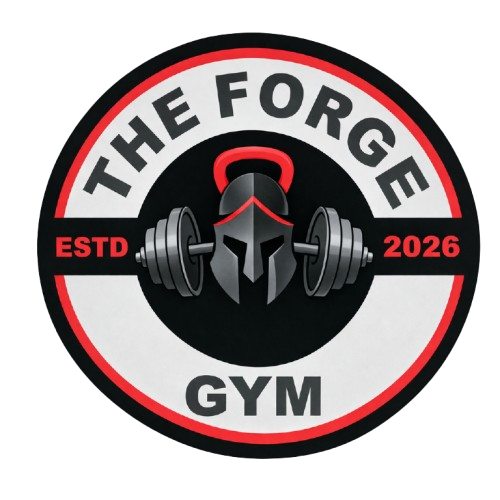

<div align="center">
  
</div>

# THE FORGE GYM

> **Where iron meets determination.**
> A premium, highly optimized Next.js 15 web application powering **The Forge Gym (Est. Jan 2026)**. Built exclusively for elite performance, SEO superiority, and a premium visual aesthetic.

---

## 🚀 Key Features

* **Next.js 15 App Router** – Taking full advantage of the newest Server Components, static generation pipelines, and optimized client-side hydration for maximum speed.
* **Tailwind CSS v4** – Gorgeous UI utilizing advanced styling, premium glassmorphism, dynamic gradients, and precision spacing without bloated bundles.
* **Flawless CSS Animations** – Pure hardware-accelerated loops (`will-change: transform`) running natively at 60fps for the Testimonials & Certificates modules. Zero heavy JavaScript carousels.
* **Smart Next/Image Engine** – Automatically serves tiny, device-appropriate images (`.webp`) to mobile users and high-definition assets to 4K desktops to protect bandwidth speed.
* **SEO Optimized** – Dynamically generated `sitemap.ts` and `robots.ts` perfectly mapped for major search engine crawlers alongside extensive Next.js metadata.
* **Dynamic Lightbox Gallery** – Fluid, responsive full-screen image expansion and overlay functionality natively integrated without external libraries.
* **Hydration Secured** – Fully protected against external browser extension DOM-injection crashes via Next.js suppression directives.

---

## 🛠️ Tech Stack

* **Framework:** [Next.js 15](https://nextjs.org/)
* **Core Library:** [React 19](https://react.dev/)
* **Styling:** [Tailwind CSS 4.0](https://tailwindcss.com/)
* **Language:** TypeScript
* **Deployment:** Vercel / AWS Amplify Ready

---

## 🏎️ Getting Started

### Prerequisites

You need `Node.js 18.18+` to natively run this platform.

### Local Development

1. Clone the repository and install the initial dependencies:
```bash
npm install
```

2. Start the development server:
```bash
npm run dev
```

3. Open [http://localhost:3000](http://localhost:3000) within your desktop or mobile browser to view the application live.

### Build for Production

This repository leverages Next.js Static Site Generation (SSG). To compile the fastest and most highly optimized production build, run:

```bash
npm run build
npm run start
```

---

## 📁 Repository Structure

* `src/app/` - Core routing, central layouts, and fully-scoped pages (Home, About, Gallery, Programs, Trainers).
* `src/components/layout/` - Global navigational scaffolding containing the interactive Navbar and Footer logic.
* `src/components/sections/` - Reusable landing page sections (Testimonials, Pricing arrays, Hero sections, and Infinite Marquees).
* `src/components/ui/` - Micro, repeatable interface components optimized for code cleanliness.
* `src/constants/data.ts` - *The central nervous system.* The single source of truth for all text, image references, membership pricing, and content. If text needs changing, it is changed here.
* `public/` - Centralized zone for localized images, icons, and logos.

---

## 📋 Ongoing Work & Scripts

### Quality Check & Linting
Run the integrated strict linter to guarantee zero syntax or variable drift:
```bash
npm run lint
```

---

## 📜 License & Copyright

&copy; **2026 The Forge Gym**. All rights reserved. 
Platform layout strictly confidential and proprietary.
